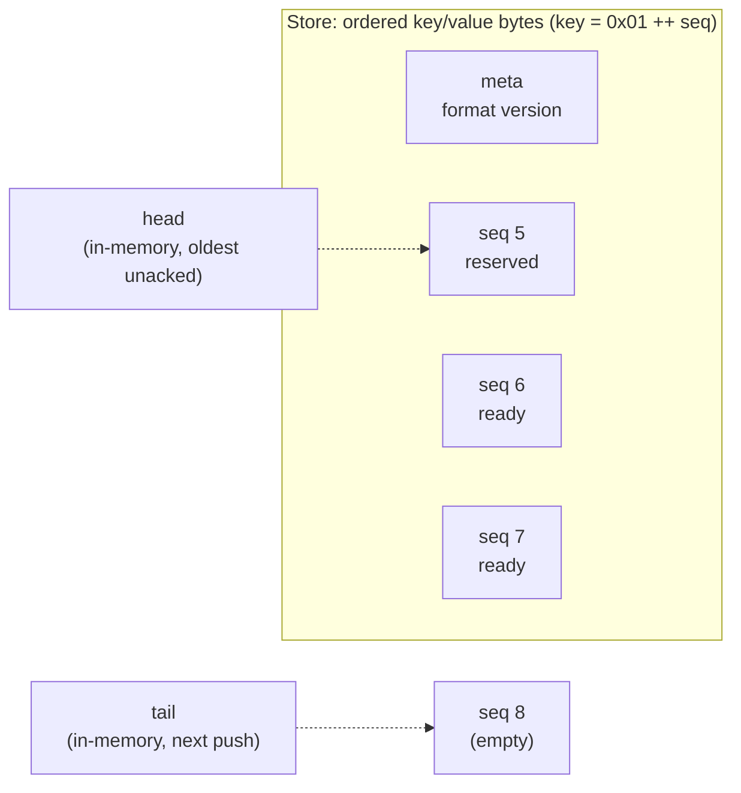
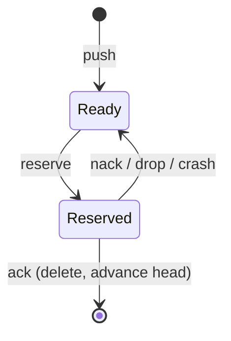

# persistent-queue - design

A durable, at-least-once, multi-producer / single-consumer (MPSC) queue. Items are
written to a pluggable byte store and survive process and machine crashes. The core
is synchronous and depends on no runtime.

This is a reference for the internals and the reasoning behind them; the public API is
documented on docs.rs.

## Non-goals

Deliberately out of scope (some may arrive later - see the README roadmap):

- Multiple or competing consumers.
- Priorities, delayed / scheduled delivery, TTL, dead-letter queues.
- Encryption or compression - do it in your codec if you need it.

## Model

The queue is an ordered log keyed by a monotonic `u64` sequence number. Two cursors,
`head` (oldest unacked) and `tail` (next sequence to write), walk that log. Neither
cursor is persisted - both are derived from the stored keys on open (see Recovery),
then maintained in memory. The set of currently reserved (in-flight) items is kept in
memory only, which is exactly what makes recovery redeliver them.

```
key space (ordered):   [0x00] meta           <- format version, written once
                       [0x01][seq: u64 BE]    <- one entry per key, value = item bytes

head = smallest existing entry key   (oldest unacked)
tail = largest existing entry key + 1 (next push)   (0 if empty)
reserved: in-memory set of seqs handed out but not yet acked
```

The same layout, and an entry's lifecycle:





Keeping entries under a `0x01` prefix keeps them ordered and contiguous in the store
and keeps the one-byte `0x00` meta record out of the entry range. The seq is stored
big-endian so lexicographic key order equals numeric order. The meta record holds only
a format version (and room for flags); it deliberately does **not** hold `head` /
`tail`, because a persisted cursor can disagree with the keys after a crash and then
has to be reconciled against them anyway - so we skip it and derive.

### Why derive the cursors instead of storing them

On open we need `tail = max(existing entry key) + 1` and `head = min(existing entry
key)`. If we also stored `head`/`tail` in the meta record, a crash between writing an
entry key and updating the meta record would leave them inconsistent, so recovery
would still have to scan the keys to fix them up. Deriving is strictly simpler, has
one source of truth (the keys), and every backend gives min/max cheaply (a B-tree
first/last, an LSM bounded iterator).

## The `Store` trait

The store is pure key/value bytes. It knows nothing about queues, sequence numbers,
or acks. It must provide ordered access in both directions and one atomic, optionally
durable, write.

```rust
pub trait Store: Send + Sync {
    type Error: std::error::Error + Send + Sync + 'static;

    /// Value for an exact key.
    fn get(&self, key: &[u8]) -> Result<Option<Vec<u8>>, Self::Error>;

    /// Smallest entry whose key is >= `from`.
    fn seek(&self, from: &[u8]) -> Result<Option<(Vec<u8>, Vec<u8>)>, Self::Error>;

    /// Greatest entry whose key is <= `upto`.
    fn seek_back(&self, upto: &[u8]) -> Result<Option<(Vec<u8>, Vec<u8>)>, Self::Error>;

    /// Apply all ops atomically. When `durable` is true, do not return until the
    /// write survives a crash (fsync). When false, it may still be in the OS page
    /// cache (fast, lost on power failure).
    fn commit(&self, ops: &[Op<'_>], durable: bool) -> Result<(), Self::Error>;
}

pub enum Op<'a> {
    Put(&'a [u8], &'a [u8]),
    Delete(&'a [u8]),
}
```

- `seek` / `seek_back` cover reserve (walk forward from `head`), recovery (`head` =
  `seek(entry_prefix)`, `tail` = `seek_back(max entry key)`), and skipping reserved
  seqs.
- `commit` applies a batch of ops and, when `durable`, does not return until they
  survive a crash. `push` is one `Put` and `ack` is one `Delete` - single-key writes,
  atomic on their own in every backend, so there are no transactions here. The list
  exists only for group-commit (many pushes behind one fsync), and it need not be
  all-or-nothing: if a crash lands mid-batch, each key that made it is a valid entry,
  and a producer only sees `Ok` after the fsync returns, so nothing is lost. Backends
  that offer atomic batches (sled, redb, rocksdb) are welcome to; we do not rely on it.

Backends: `mem` (a `Mutex<BTreeMap>`, the default; `durable` is a no-op), `sled`,
`redb`, and `rocksdb` (a bundled C++ build), each behind its own feature. Any other
store - a raw append-only file, an object store - is a downstream `Store` impl.

A typed layer (`Builder::open_typed`) wraps this byte core with a `Codec` that encodes
on push and decodes on reserve; `serde` + `bincode` is built in behind the `serde`
feature. The store stays pure bytes - the codec is the only thing that knows the shape.

## Concurrency

One `Mutex<Inner>` guards the in-memory state: `tail`, `head`, the `reserved` set,
`closed`, and a producers-waiting condvar. The rules:

- **The lock is never held across store I/O.** Under the lock a producer claims a
  sequence number and a capacity slot; the `commit` (the fsync) runs after the lock is
  released. Holding it across the fsync would serialise every producer at disk speed
  and defeat having multiple producers at all.
- **Backpressure.** When the queue is full - unacked count at `capacity`, or unacked
  bytes at `max_bytes` - `push` waits on a condvar; `ack` signals it after freeing a
  slot. (A planned tokio facade would run the
  call on `spawn_blocking` so the blocking wait is off the async worker; an
  async-native wait is a later refinement.)
- **Single consumer.** `reserve` walks forward from `head` with `seek`, skips any seq
  already in the `reserved` set, marks the chosen seq reserved, and returns it. `ack`
  deletes the key; if it acked the seq at `head`, `head` advances past the contiguous
  run of already-acked seqs (kept in memory), so `head` is always the oldest unacked
  seq. An out-of-order ack is remembered and folded in once `head` reaches it. Because
  `reserved` is in memory, a crash clears it and every unacked entry is reservable
  again from `head`.

No data race results, and it is worth being precise about why. Every access to the
shared in-memory state (`tail`, `head`, `reserved`, the count, `closed`) is under the
one mutex, so there is never unsynchronised shared access. Two producers committing at
once write *different* keys (their own claimed seqs) through a `Send + Sync` store
whose `commit` takes `&self` and synchronises internally, so those accesses do not
conflict either. The only thing the lock does not order is which commit reaches disk
first - and that is not a data race, just nondeterministic durability order, which the
design tolerates: a crash can leave a gap (seq 6 durable, seq 5 not), `reserve` skips
gaps via `seek`, and the producer of the missing seq never received `Ok`. A failed
`commit` re-locks to release its capacity slot; the claimed seq is never reused (a
benign gap). loom verifies exactly this handoff.

Lock-free is deliberately not a goal: the cost is dominated by the `commit` fsync,
so removing an uncontended in-memory lock would not move the number.

## Durability policies

- `Sync` (default) - every push and ack fsyncs. Slowest, strongest.
- `Group` - group-commit. Concurrent pushes batch behind a single fsync: a leader
  flushes the pending batch and the rest wait for their seq. Acks still fsync each,
  since a single consumer rarely has acks to batch. Same crash-durability as `Sync`,
  far less fsync overhead under load.
- `None` - no fsync. Fastest, but no durability guarantee: recent items can be lost
  on a crash. What survives is up to the backend (redb, for one, keeps a `None`
  commit unpersisted until the next durable commit). `MemStore` never persists,
  regardless of policy.

## Crash recovery

On `open`:

1. `head = seek([0x01])` -> smallest entry key, or the queue is empty.
2. `tail = seek_back([0x01, 0xFF..]) + 1`, or `0` if empty.
3. `reserved` starts empty. Every stored entry is therefore reservable - anything
   that was in flight when we crashed is simply redelivered. That is the at-least-once
   behaviour, and it needs no recovery code of its own.
4. Read / write the meta version record; refuse to open a store written by a newer
   format.

Write ordering that makes this correct:

- `push` commits the entry `Put` before returning. A crash before the commit means
  the item was never accepted (the caller has not gotten `Ok`); a crash after means
  the key exists and is recovered.
- `ack` commits the `Delete` before returning `Ok`. A crash before the delete is
  durable leaves the key present, so the item is redelivered - at-least-once, as
  intended.

## Verification

- **loom** model-checks the in-memory concurrency: the lock, the condvar wake, the
  reserved-set handoff, close, and the out-of-order-commit race, over a mock store.
- **Miri** runs the unit and integration tests for undefined behaviour and data races.
- A **fault-injecting store** simulates a crash (stop applying writes at an arbitrary
  point, drop non-durable writes) and a failing `commit`, asserting no item is lost and
  the queue reopens cleanly.
- **Benchmarks** (criterion): throughput across backends, durability policies, and
  producer counts is in [BENCHMARKS.md](./BENCHMARKS.md).
