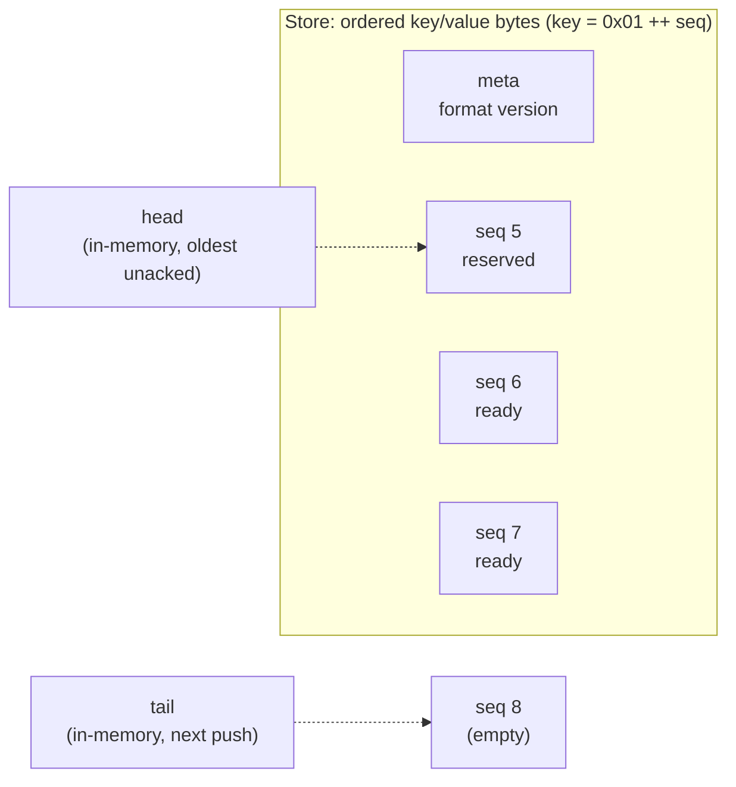
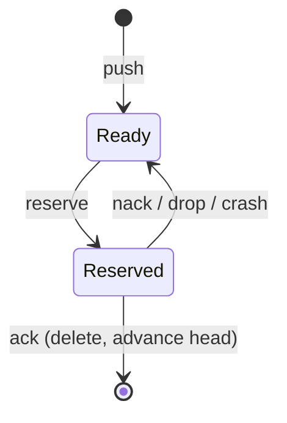

# persistent-queue

[](https://github.com/rolandjitsu/persistent-queue/actions/workflows/ci.yml)
[](https://crates.io/crates/persistent-queue)
[](https://docs.rs/persistent-queue)
[](./LICENSE)

A durable, at-least-once MPSC queue backed by in-memory and durable backends.

Items are written to a backend that survives process and machine crashes. Delivery
is at-least-once: an item is removed only once the consumer acks it, so a crash
between handling and ack redelivers it. The core is synchronous and runtime-agnostic.

## What it does

You push byte payloads from any number of producers and reserve them from a single
consumer. Each reserved item is held in flight until you `ack` it (remove it) or
`nack` it (return it for redelivery). Dropping a reservation, panicking, or crashing
all put the item back, so nothing is lost.

Storage is a pluggable `Store`: an in-memory backend by default, `sled` or `redb`
behind features, or your own.

## How it works

Entries are stored under keys `0x01 ++ seq`, where `seq` is a monotonic `u64`. Two
cursors, `head` (oldest unacked) and `tail` (next to write), are derived from the
stored keys on open, so there is nothing extra to keep consistent across a crash.
The set of reserved (in-flight) items is kept in memory only, which is exactly what
makes recovery redeliver them.



An entry's lifecycle:



## Usage

```rust
use persistent_queue::{Builder, MemStore};

let (tx, rx) = Builder::new(MemStore::new()).capacity(1024).open().unwrap();

tx.push(b"job").unwrap(); // waits if the queue is at capacity

if let Some(item) = rx.reserve().unwrap() {
    assert_eq!(&*item, b"job"); // derefs to the bytes
    item.ack().unwrap();        // remove it; or item.nack() to retry later
}
```

For durability, use an on-disk backend:

```rust,ignore
use persistent_queue::{Builder, SledStore};

let store = SledStore::open("/var/lib/myapp/queue").unwrap();
let (tx, rx) = Builder::new(store).capacity(1024).open().unwrap();
```

`RedbStore::open` works the same way behind the `redb` feature.

## Backends

| Backend       | Feature   | Persistent | Notes                                  |
| ------------- | --------- | ---------- | -------------------------------------- |
| `MemStore`    | (default) | No         | Zero dependencies; tests and baseline. |
| `SledStore`   | `sled`    | Yes        | On-disk, backed by sled.               |
| `RedbStore`   | `redb`    | Yes        | On-disk, backed by redb.               |

Implement `Store` yourself for any other key/value store.

## Guarantees

- **Durability.** Once `push` returns under a durable policy, the item survives a
  crash.
- **At-least-once.** Every pushed item is delivered at least once. A crash between
  handling an item and its durable ack redelivers it. True exactly-once is not
  possible from the queue alone; `Reserved::seq()` is a stable id you can dedupe on
  for effectively-once (see the roadmap).
- **Order.** FIFO by sequence number; `reserve` hands items out oldest first.

Durability is a policy on the builder: `Sync` (fsync every push and ack) or `None`
(page cache only; survives a process crash but not a power loss).

## Operational notes

- **One process per store.** `sled` and `redb` take an exclusive lock on their file,
  so only one process can open a given database at a time.
- **Corruption is surfaced, not repaired.** A backend error on open (including a
  corrupt store) is returned as `OpenError::Store`; the queue does not auto-repair or
  discard data. A store written by a newer on-disk format is rejected with
  `OpenError::UnsupportedVersion`.

## Comparison

How persistent-queue relates to some common alternatives - it is durable,
at-least-once, multi-producer, and backend-agnostic:

| Crate                | Durable | Producers / consumers | Storage                            |
| -------------------- | ------- | --------------------- | ---------------------------------- |
| `persistent-queue`   | Yes     | MPSC                  | in-memory, sled, redb, or your own |
| `yaque`              | Yes     | SPSC                  | files                              |
| `sled`, `redb`       | Yes     | not a queue           | own file (key/value store)         |
| `flume`, `crossbeam` | No      | MPMC                  | in-memory                          |

`yaque` is a persistent queue but single-producer / single-consumer (its docs: "an
SPSC channel using your OS' filesystem"). `sled` and `redb` are key/value stores,
not queues - persistent-queue is built on top of them. `flume` and `crossbeam` are
fast in-memory channels with no durability. Backends and semantics change over time;
check each crate's current docs.

## Roadmap

- **Group-commit** durability, batching many pushes behind one fsync for throughput.
- **Codec features** (`serde`, `rkyv`) and a typed `Queue<T>` layer over the byte core.
- **tokio async facade** (feature-gated), an async API over the sync core.
- **More backends**: `rocksdb`, and a log-structured / append-only backend for very
  high write volume.
- **Richer delivery**: multiple / competing consumers with visibility timeouts,
  dead-letter handling after N redeliveries, priorities and delayed delivery.
- **Byte-based capacity**, to bound on-disk size directly (today it bounds by unacked
  count).
- **Effectively-once helper**: `Reserved::seq()` already survives redelivery as a
  stable id; an opt-in helper could persist processed seqs so the consumer dedupes
  automatically.
- **Zero-copy reads**: return `Bytes` or borrowed data from the store to skip a copy
  per reserve (pairs with the rkyv codec).

## Status

Early, single-maintainer software. The surface is intentionally small: a producer,
a consumer, the `Reserved` guard, and the `Store` trait. Contributions welcome.

## License

[Apache-2.0](./LICENSE).
